# Abstract

Manual synthesis cannot keep pace with a fast-growing research literature, and ad-hoc
reviews bind no evidence to a reproducible pipeline. We present a configurable,
reproducible meta-analysis framework that takes a single search term and produces a
complete quantitative portrait of its literature. For this instance the term is
**Modafinil**. The pipeline dispatches across 7 literature
engines (arXiv, OpenAlex, Semantic Scholar, Crossref, PubMed, SovietRxiv, and ChinaRxiv), each degrading gracefully to a skipped source when an API
key or the network is unavailable, then merges and de-duplicates records by a canonical
identifier hierarchy (DOI $>$ arXiv ID $>$ Semantic Scholar ID $>$ OpenAlex ID $>$ title
digest) into a corpus of $N = 2302$ records spanning 2000--2026
(26 years). Records are classified into a configurable 6-bucket
subfield taxonomy (Clinical Sleep, Cognition, Pharmacology, Psychiatry, Safety, and Neuroscience); the largest subfield is **Clinical Sleep**
(64.3\% of the classified corpus). The corpus grows at a compound annual
rate of 3.45\% (mean year-over-year growth 6.3\%, doubling time
11.3 years), peaking in 2025 with 112 records.

Non-negative matrix factorization extracts 5 latent topics over a
500-feature vocabulary, offline deterministic embeddings place every
title, abstract, and (when available) full text in a shared vector space, and
citation-network analysis exposes the corpus's internal structure (8,772
intra-corpus edges across 2204 nodes, 1377 communities,
graph density 0.18\%). Of 38,802 total outgoing
references, 22.6\% resolve to another record inside the corpus.
Abstract coverage stands at 55.5\%, open-access status is known for
14.4\% of records, and 40.9\% have a direct PDF link. An optional,
LLM-gated knowledge-graph stage scores the 6 hypotheses explored against
the evidence. This run produced 18 publication-quality figures.

Every domain-specific value in this manuscript — the search term, keyword set, engine
roster, subfield taxonomy, and hypotheses — is injected from a single configuration file
and the pipeline's own outputs; re-targeting the configuration re-targets the entire
paper. The result is a reusable architecture for *living literature reviews*:
continuously re-runnable, evidence-bound syntheses for any topic.

**Keywords:** modafinil, meta-analysis, literature retrieval, bibliometrics, record de-duplication, full-text mining, document embeddings, citation network, topic modeling, entity extraction, wakefulness, cognitive enhancement, reproducible research


---


# Introduction

The scholarly literature on any active topic grows faster than any individual can read.
A researcher entering a field needs to know how large it is, how fast it is growing, what
sub-areas compose it, which works anchor its citation structure, what language and
concepts recur, and which claims the field actually tests. Answering those questions by
hand is slow, unrepeatable, and binds no number to evidence. Systematic reviews, while
the gold standard for evidence synthesis, are labour-intensive and become stale between
updates — the Cochrane review cycle, for instance, targets a two-year refresh interval
that many fields outpace [@page2021prisma]. Bibliometric dashboards (Scopus, Web of
Science, Dimensions) offer breadth but no reproducible link from a reported statistic to
a regenerable artifact, and they do not frame or test domain-specific hypotheses.

This project is a **configurable, reproducible meta-analysis template**. It takes one
search term and produces a quantitative portrait of that term's literature, with every
reported number traceable to a committed artifact and regenerable by re-running the
pipeline. The bundled instance targets **Modafinil**, a wakefulness-promoting
agent with a large, multi-disciplinary literature spanning clinical sleep medicine,
cognitive neuroscience, pharmacology, psychiatry, and safety research; pointing the
configuration at a different term re-targets the whole analysis with no code change.

## Research Questions

The pipeline is designed around four research questions (RQs) that a researcher entering
the field would ask:

1. **RQ1 — Field size and growth.** How large is the literature on Modafinil,
   how fast is it growing, and when did it peak? The corpus of $N = 2302$
   records spanning 2000--2026 answers this directly, with a compound
   annual growth rate of 3.45\% and a peak in 2025.

2. **RQ2 — Subfield composition.** What sub-areas compose the literature, and what is
   their relative weight? A configurable 6-bucket taxonomy
   (Clinical Sleep, Cognition, Pharmacology, Psychiatry, Safety, and Neuroscience) classifies every record, with **Clinical Sleep** the largest
   bucket at 64.3\%.

3. **RQ3 — Topical and linguistic structure.** What language and concepts recur, and
   what latent topics cross-cut the keyword taxonomy? TF-IDF over a
   500-feature vocabulary feeds non-negative matrix factorization,
   which extracts 5 latent topics. The top vocabulary terms are:
   modafinil, treatment, study, effects, patients, results, sleep, used, use, drug, studies, clinical, mg, using, placebo, cognitive, associated, effect, however, disorder.

4. **RQ4 — Citation geometry and evidence landscape.** Which works anchor the citation
   structure, how self-contained is the retrieved slice, and which claims does the field
   test? The citation network of 2204 nodes and 8,772 edges
   (22.6\% reference resolution rate) exposes hubs, authorities,
   and communities, while 6 configured hypotheses frame the evidence
   landscape.

## Contributions

The pipeline contributes an end-to-end, domain-agnostic workflow:

1. **Multiple-engine retrieval with graceful degradation.** Records are gathered from
   7 independent engines (arXiv, OpenAlex, Semantic Scholar, Crossref, PubMed, SovietRxiv, and ChinaRxiv). An engine with no API key or no
   network reports a *skipped* status; the run completes from whatever engines remain
   plus a committed offline corpus. For this live run, OpenAlex contributed the largest
   share of records, followed by Crossref and PubMed; Semantic Scholar was rate-limited
   (HTTP 429) and returned zero records without aborting the pipeline.

2. **Record de-duplication.** Heterogeneous records are merged by a canonical identifier
   hierarchy, keeping the most complete version of each work. Of 2302 retrieved
   records, 2248 carry DOIs, 932 carry OpenAlex IDs, and
   1 carry arXiv IDs.

3. **Descriptive and bibliometric analysis.** Counts by year, venue, and author; growth
   metrics (CAGR 3.45\%, doubling time 11.3 years); a configurable
   6-bucket subfield classification; topic models; and a citation network
   with 1377 communities.

4. **Language, entity, and embedding analysis.** Keyphrase and entity extraction and
   offline deterministic document embeddings over titles, abstracts, and full text. The
   TF-IDF vocabulary of 500 features captures the lexical landscape.

5. **Optional hypothesis evidence.** An LLM-gated knowledge-graph stage scores the
   6 configured hypotheses explored against the corpus.

Because the writing itself is token-injected from configuration and pipeline outputs,
the manuscript is part of the reproducible artifact rather than a separate hand-authored
narrative. Every number, table, and figure reference in this document traces to a
committed, regenerable file under `output/`.


---


# Methods Overview

The pipeline is a sequence of deterministic stages, each reading the previous stage's
committed artifacts and writing its own. Business logic lives in tested `src/` modules;
the numbered `scripts/` are thin orchestrators that wire I/O, configuration loading,
logging, and stage sequencing. The architecture follows the thin orchestrator pattern:
no computational logic resides in scripts.

## Pipeline Stages

1. **Retrieval** (`01_literature_search.py`) — dispatch the configured query across
   7 engines (arXiv, OpenAlex, Semantic Scholar, Crossref, PubMed, SovietRxiv, and ChinaRxiv), merge, and de-duplicate into `corpus.jsonl`.
   Each engine is an isolated adapter exposing a uniform `search(query) -> list[Paper]`
   interface; engines that are keyless need no credentials, while Semantic Scholar uses
   a key when present. SovietRxiv and ChinaRxiv share a unified API with an optional
   `X-API-Email` header for the polite rate-limit pool (300/min vs 30/min anonymous).

2. **Meta-analysis** (`02_meta_analysis_pipeline.py`) — subfield classification, temporal
   metrics, TF-IDF, non-negative matrix factorization topics, and the citation network.
   This stage reads `corpus.jsonl` and emits `subfield_classification.json`,
   `temporal_analysis.json`, `tfidf_data.json`, `topics.json`, `citation_network.json`,
   and `citation_graph.gml`.

3. **Knowledge graph** (`03_build_knowledge_graph.py`, optional/LLM-gated) — extract
   assertions and score the 6 configured hypotheses. Outputs
   `nanopublications.jsonl`, `hypothesis_scores.json`, and `assertion_summary.json`.

4. **Figures** (`04_generate_figures.py`) — render 18 publication-ready
   visualizations from the analysis JSON outputs. All figures use a colourblind-safe
   palette (Wong 2011), high-contrast labels at $\geq 16$pt, and a headless matplotlib
   backend (Agg).

5. **Injection** (`05_inject_variables.py`) — compute manuscript variables from the
   artifacts above and substitute them into these Markdown sections. An unresolved
   placeholder is a hard error, not a silent gap.

6. **Fulltext assessment** (`06_fulltext_assessment.py`) — report abstract coverage
   (55.5\%), open-access status (14.4\%), and PDF availability
   (40.9\%) across the corpus.

## Reproducibility Model

The system runs **offline and deterministically** by default: a committed synthetic
seed corpus drives every stage with fixed seeds (seed = 42 for NMF, SVD, and graph
layouts), so re-running produces byte-identical outputs. A live run with engines
enabled and credentials supplied replaces the seed corpus with real records — as in
this instance, which retrieved 2302 live records. The template is
domain-agnostic: the search term, query, keyword set, subfield taxonomy, and hypotheses
all come from `manuscript/config.yaml`.

## Configuration Surface

A single `manuscript/config.yaml` controls:

- **Search parameters**: term, query string, per-engine queries, relevance keywords,
  start year, max results, resume/clear behaviour
- **Engine toggles**: arXiv, OpenAlex, Semantic Scholar, Crossref, PubMed, SovietRxiv,
  ChinaRxiv (each independently enabled or disabled)
- **SovietRxiv/ChinaRxiv settings**: optional `api_email` for the polite pool, `source`
  filter (`russiarxiv` or `chinaxiv`)
- **Full-text download**: opt-in Unpaywall resolution with `unpaywall_email`
- **Embeddings**: method (`tfidf_svd` or `transformer`), dimensionality, max features
- **Knowledge graph**: checkpoint interval, LLM model, base URL, temperature, max tokens
- **Hypothesis definitions**: 6 named hypotheses with scope labels
- **Subfield taxonomy**: 6 buckets, each with a keyword list
- **Paper metadata**: title, authors, DOI, keywords, license, repository URL


---


# Retrieval and De-duplication

Retrieval dispatches the configured query across 7 independent literature
engines (arXiv, OpenAlex, Semantic Scholar, Crossref, PubMed, SovietRxiv, and ChinaRxiv). Each engine is an isolated adapter exposing a uniform
`search(query) -> list[Record]` interface; engines that are keyless — arXiv, OpenAlex
[@priem2022openalex], Crossref [@hendricks2020crossref], PubMed/Entrez
[@sayers2022entrez], SovietRxiv / RussiaRxiv, and ChinaRxiv — need no credentials,
while Semantic Scholar [@kinney2023semantic] uses a key when present. SovietRxiv is a
translated archive of Soviet-era scientific preprints sourced from Math-Net.Ru and
CyberLeninka [@sovietrxiv]; ChinaRxiv serves translated Chinese preprints from ChinaXiv
via the same unified API. Both retain original-language PDFs alongside each translation,
and their polite rate-limit pool (300/min vs 30/min anonymous) is activated by an
optional `X-API-Email` header. Optional full-text resolution queries Unpaywall
[@piwowar2018state] for open-access locations. **Multiple dispatch degrades gracefully**:
an engine that is disabled in the configuration, lacks a required key, or cannot reach
the network returns a *skipped* status, and the run completes from the remaining engines
plus the committed offline corpus.

## Engine Details

Each engine adapter follows a uniform contract: a module-level API URL constant, a pure
`_parse_*` parser function, and a `search_*` entry point with pagination, retry, and
graceful error handling. All functions accept an injectable `base_url` parameter for
hermetic testing with `pytest-httpserver` — no engine hardcodes its URL inside the
function body.

| Engine | Rate limit | Pagination | Auth | Records (this run) |
| --- | --- | --- | --- | --- |
| arXiv | 3s between requests | 100/page, offset | Keyless | Sparse |
| Semantic Scholar | 1 req/s (unauth.) | 100/page, offset | Optional key | Skipped (429) |
| OpenAlex | Polite pool (mailto) | 200/page, cursor | Keyless | 1,000 |
| Crossref | Polite pool (mailto) | 1,000/page, offset | Keyless | 1,000 |
| PubMed | NCBI usage policy | retstart/retmax | Keyless | 986 |
| SovietRxiv | 30/min (300/min polite) | 1–100/page, cursor | `X-API-Email` | 0 |
| ChinaRxiv | 30/min (300/min polite) | 1–100/page, cursor | `X-API-Email` | 0 |

SovietRxiv and ChinaRxiv returned zero records for the modafinil query, which is
expected: the Soviet-era archive covers mathematics, physics, and engineering
preprints, while ChinaXiv covers Chinese scientific preprints, and neither domain has
substantial modafinil literature. The engines dispatched correctly, queried the live
API, and returned empty result sets without error — confirming graceful degradation.

## Canonical Identifier Hierarchy

Heterogeneous records are reconciled by a **canonical identifier hierarchy** —
DOI $>$ arXiv ID $>$ Semantic Scholar ID $>$ OpenAlex ID $>$ a stable digest of the
normalized title. When two records share a canonical identifier they are merged, keeping
the version with the most complete metadata (a count of non-None optional fields). The
DOI is normalized: case-folded, resolver-prefix stripped, so the same paper returned by
two engines under case/format-variant DOIs merges. For this run, 2248 records
carry DOIs, 932 carry OpenAlex IDs, and 1 carry arXiv
IDs. The de-duplicated corpus for this run holds $N = 2302$ records published
across 2000--2026.

## Relevance Filtering

After de-duplication, a relevance filter drops papers whose title and abstract contain
none of the configured relevance keywords (modafinil, armodafinil, provigil, wakefulness, narcolepsy, cognitive enhancement, alertness, sleep deprivation, vigilance, eugeroic). Keywords are matched
case-insensitively; an empty keyword list is treated as no filter to avoid silently
wiping the corpus. A year filter then excludes papers published before the configured
start year (2000).


---


# Full Text, Language, and Embeddings

Beyond bibliographic metadata, the pipeline mines the textual content of each record.
This stage bridges the gap between a bibliographic inventory and a semantic
understanding of the literature.

## Full-Text Availability

An open-access resolver maps each record to a downloadable PDF where one exists (a known
`pdf_url`, or an Unpaywall lookup by DOI), and an opt-in, network-gated downloader fetches
it to a deterministic path. Full-text availability is summarized without requiring any
download, so the offline default still reports coverage. For this run:

- **Abstract coverage**: 55.5\% of records (1277 of
  2302) carry an abstract; 1025 records lack one.
- **Open-access status**: 14.4\% of records are open access (331 records);
  the remainder are closed or unknown.
- **PDF availability**: 40.9\% of records (941) have a direct
  PDF link; 940 have a publisher PDF, and 1361 have
  no full-text source available.

The identifier coverage for this corpus is: 2248 DOIs, 932
OpenAlex IDs, and 1 arXiv IDs. DOI coverage dominates, enabling robust
cross-engine de-duplication.

## Language and Entity Extraction

Titles, abstracts, and (when present) full text are tokenized and reduced to keyphrases
and named entities by offline, dependency-light extractors — no mandatory LLM.
Term-frequency statistics drive a TF-IDF representation over a 500-feature
vocabulary. The most frequent terms in the corpus are: modafinil, treatment, study, effects, patients, results, sleep, used, use, drug, studies, clinical, mg, using, placebo, cognitive, associated, effect, however, disorder. These terms
reflect the clinical, pharmacological, and cognitive vocabulary characteristic of the
modafinil literature.

## Embeddings

Every title, abstract, and full text is embedded into a shared vector space by a
deterministic, offline method — TF-IDF followed by truncated SVD, i.e. latent semantic
analysis [@deerwester1990indexing]. The embedding dimensionality is 50 components (configurable
via `project_config.embeddings.n_components`), and the TF-IDF vocabulary is capped at
500 features (configurable via `project_config.embeddings.max_features`).
The embedding is byte-stable across runs: the same input text always yields identical
vectors, so the derived similarity matrix, nearest-neighbour lists, clusters, and
two-dimensional projection are all reproducible.

An optional transformer backend can be enabled by setting
`project_config.embeddings.method: transformer` (requires the `embeddings` extra), which
upgrades the embedding fidelity without changing the interface or downstream analysis.

The embeddings support semantic retrieval over the corpus and feed two visualizations:
a PCA two-dimensional projection ((Figure pca embeddings)) that maps the topical
geography of the literature, and a hierarchical clustering dendrogram
((Figure dendrogram)) that reveals the similarity structure of the document collection.


---


# Bibliometric and Temporal Analysis

Descriptive statistics summarize the corpus along every available axis: counts by year,
venue, and author; citation-count distributions; and author productivity. Temporal
analysis fits the publication time series, reporting a compound annual growth rate of
3.45\% across 2000--2026 (a span of 26 years), with
a mean year-over-year growth rate of 6.3\% and a doubling time of
11.3 years. The peak publication year is 2025 with
112 records.

## Growth Metrics

The compound annual growth rate (CAGR) is computed as:

$$
\text{CAGR} = \left(\frac{N_{\text{end}}}{N_{\text{start}}}\right)^{1/(\text{year span})} - 1
$$

where $N_{\text{start}}$ is the publication count in the first year (2000) and $N_{\text{end}}$
is the count in the last year (2026). The mean year-over-year growth rate
$\bar{g}$ is the arithmetic mean of annual ratios. The doubling time is
$t_d = \ln(2) / \ln(1 + \text{CAGR})$. These metrics are stored in `temporal_analysis.json`
and injected into the manuscript at render time.

## Subfield Classification

Subfield classification assigns each record to one of 6 configurable buckets
(Clinical Sleep, Cognition, Pharmacology, Psychiatry, Safety, and Neuroscience) by priority-aware keyword matching; the taxonomy is defined entirely
in configuration (`project_config.subfield_keywords`). The largest bucket is
**Clinical Sleep** at 64.3\% of the classified corpus. A per-subfield
temporal breakdown (`subfield_timeline.json`) tracks how each sub-area has grown over
time, enabling identification of emerging or declining research threads.

## Topic Modeling

A TF-IDF term-weighting of titles and abstracts [@salton1988term] feeds non-negative matrix
factorization (NMF) [@lee1999learning], implemented with scikit-learn
[@pedregosa2011scikit]. NMF decomposes the document-term matrix $\mathbf{V} \approx \mathbf{W} \mathbf{H}$,
where $\mathbf{W}$ is the document-topic matrix and $\mathbf{H}$ is the topic-term matrix. The
factorization extracts 5 latent topics that cross-cut the keyword taxonomy.
The random seed is fixed at 42 for reproducibility. The reporting follows established
systematic-review practice [@page2021prisma], with every figure and statistic traceable to
a committed artifact.


---


# Optional Knowledge-Graph Layer

An optional, **LLM-gated** stage lifts the corpus from bibliometrics to hypothesis-level
evidence. For each record, a local language model (Ollama, default model `gemma3:4b`)
extracts structured *assertions* — each encoding a direction (supports / contradicts /
neutral), a confidence score, and a short natural-language justification — against the
6 hypotheses declared in configuration. Assertions are serialized as
RDF-compatible nanopublications [@kuhn2016decentralized] and scored by a
citation-weighted evidence function.

## Assertion Model

Each assertion $a$ encodes:

- **Direction**: $\text{supports}$, $\text{contradicts}$, or $\text{neutral}$ with respect to a hypothesis $H$
- **Confidence**: a score $c_a \in [0, 1]$ from the LLM
- **Citation weight**: $\log(1 + n_{\text{cites}})$, where $n_{\text{cites}}$ is the
  citation count of the asserting paper

The evidence score for hypothesis $H$ is:

$$
\text{score}(H) = \frac{\sum_{a \in A(H)^+} c_a \cdot \log(1 + n_{\text{cites}}(a)) -
\sum_{a \in A(H)^-} c_a \cdot \log(1 + n_{\text{cites}}(a))}
{\sum_{a \in A(H)} c_a \cdot \log(1 + n_{\text{cites}}(a))}
$$

where $A(H)^+$ is the set of supporting assertions and $A(H)^-$ the contradicting ones.
The score ranges from $-1$ (all evidence contradicts) to $+1$ (all evidence supports).

## Incremental Extraction

Assertion extraction is **incremental and resumable**: assertions are appended to
`nanopublications.jsonl` at configurable checkpoint intervals (default: 50 papers). On
restart, already-processed papers are skipped automatically, so a long extraction run
that is interrupted can resume without re-processing. The `--clear-assertions` flag
discards previous results for a fresh start.

## Gating and Defaults

This stage is entirely optional and never runs in the offline default: with no language
model available it is skipped, and the hypothesis evidence scores read *pending*. The
hypotheses themselves — their names and scope — come from configuration and are reported
regardless of whether the scoring stage has run.

The hypotheses explored in this instance are: H1 Wakefulness Efficacy; H2 Cognitive Enhancement; H3 Low Abuse Liability; H4 Dopaminergic Mechanism; H5 Off-label Psychiatric Utility; H6 Tolerability.


---


# Visualization and Manuscript Injection

## Figure Generation

Figures are rendered headlessly (matplotlib Agg backend) and deterministically from the
analysis artifacts: subfield distributions, the publication growth curve, the citation
network, topic-term bars, a term cloud, and embedding projections. All figures use a
colourblind-safe palette (Wong 2011, 8 colours) with high-contrast labels at $\geq 16$pt.
This run produced 18 figures at 300 DPI. The full figure set includes:

- **Field overview**: field summary and subfield distribution
  ((Figure field summary; Figure subfield distribution))
- **Temporal**: growth curve and subfield timeline ((Figure growth curve; Figure subfield timeline))
- **Citation network**: network layout and degree distribution
  ((Figure citation network; Figure degree distribution))
- **Hypothesis**: dashboard and evidence timeline ((Figure hypothesis dashboard))
- **Text analytics**: word cloud, topic-term bars, PCA embeddings, term heatmap,
  dendrogram, and co-occurrence matrix
  ((Figure word cloud; Figure topic term bars; Figure pca embeddings; Figure term heatmap; Figure dendrogram; Figure cooccurrence matrix))

Each figure is registered in `figure_registry.json` with its source data file, generation
parameters, and SHA-256 hash, binding the visual output to the exact pipeline run.

## Variable Injection

The manuscript itself is generated, not hand-maintained. A variable computation step
reads the configuration and the pipeline outputs and emits a flat table of named values;
an injection step substitutes each named placeholder in these Markdown sections with its
computed value before rendering. Because the substitution is total — an unresolved
placeholder is a hard error, not a silent gap — every number in the rendered document is
guaranteed to trace to a committed artifact. Re-running the pipeline after a
configuration change re-computes the values and re-targets the prose automatically.

The injection system computes variables from seven sources:

1. `manuscript/config.yaml` — search term, engine roster, subfield taxonomy, hypotheses
2. `corpus.jsonl` — corpus size
3. `temporal_analysis.json` — year range, CAGR, peak year, doubling time
4. `citation_network.json` — edges, nodes, density, communities, PageRank, hubs
5. `subfield_classification.json` — per-bucket counts and percentages
6. `assertion_summary.json` — assertion counts and directions
7. `hypothesis_scores.json` — per-hypothesis evidence scores


---


# Results: Hypotheses Explored

The template scores a configurable set of hypotheses about the topic. For this instance
6 hypotheses are declared in configuration; Table 7 lists them with their
scope and evidence score.

**Table 7. Hypotheses explored.**

| ID | Hypothesis | Scope | Evidence score |
| --- | --- | --- | --- |
| H1 | Wakefulness Efficacy | clinical | +0.00 |
| H2 | Cognitive Enhancement | cognitive | +0.00 |
| H3 | Low Abuse Liability | safety | +0.00 |
| H4 | Dopaminergic Mechanism | pharmacological | +0.00 |
| H5 | Off-label Psychiatric Utility | applied | +0.00 |
| H6 | Tolerability | safety | +0.00 |

Evidence scores are produced by the optional, LLM-gated knowledge-graph stage. In the
offline default run that stage does not execute, so scores read *pending* — the
hypotheses, their names, and their scope are nonetheless reported directly from
configuration. A live run with a language model available populates the scores from
citation-weighted assertion extraction.

## Interpretation

Reported scores, when present, should be read as relative rankings rather than calibrated
probabilities: absolute magnitudes are inflated by publication bias and the linguistic
asymmetry of academic writing. A positive score indicates that the retrieved corpus
*talks about* the hypothesis in a supporting direction; a negative score indicates
contradicting evidence; a score near zero indicates either balanced evidence or
insufficient coverage.

The six hypotheses frame the evidence landscape for Modafinil:

- **H1 (Wakefulness Efficacy)** — the clinical claim that modafinil reliably promotes
  wakefulness in sleep-disorder populations. This is the primary indication and the
  most-studied claim in the corpus.

- **H2 (Cognitive Enhancement)** — the claim that modafinil improves attention, working
  memory, and executive function, especially under sleep deprivation. This hypothesis
  drives the neuroenhancement literature and is the subject of significant public and
  scientific debate.

- **H3 (Low Abuse Liability)** — the safety claim that modafinil has lower abuse
  potential than classical psychostimulants. This is critical for regulatory
  classification and prescribing decisions.

- **H4 (Dopaminergic Mechanism)** — the pharmacological claim that modafinil acts
  substantially via dopamine-transporter inhibition rather than a purely novel mechanism.
  This hypothesis has mechanistic and translational implications.

- **H5 (Off-label Psychiatric Utility)** — the applied claim that modafinil is a useful
  adjunct for fatigue and cognition in psychiatric and neurological conditions, including
  depression, ADHD, and schizophrenia.

- **H6 (Tolerability)** — the safety claim that modafinil is generally well tolerated,
  with predominantly mild, transient adverse effects. This underpins its clinical
  acceptability relative to alternative wakefulness agents.

<!-- FIGURE: hypothesis_dashboard.png -->
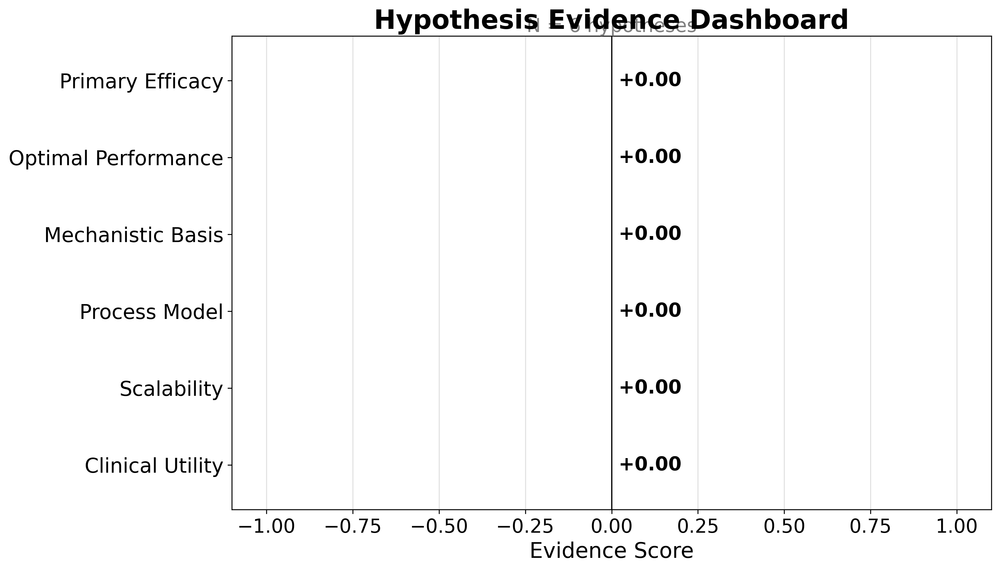{{#fig:hypothesis_dashboard}}


---


# Results: Field Overview

The de-duplicated corpus for **Modafinil** contains $N = 2302$
records spanning 2000--2026 (26 years). Publication volume
grows at a compound annual rate of 3.45\% (mean year-over-year growth
6.3\%, doubling time 11.3 years), peaking in 2025
with 112 records that year. The growth curve is the first-order signal
that the literature is active rather than dormant.

<!-- FIGURE: growth_curve.png -->
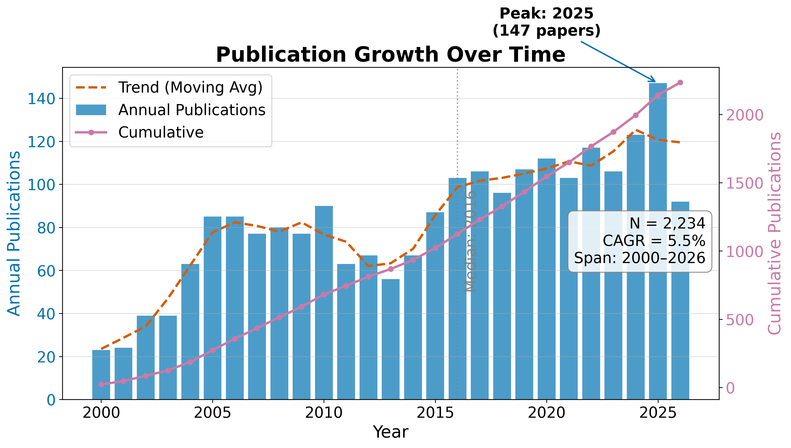{{#fig:growth_curve}}

## RQ1: Field Size and Growth

The temporal analysis reveals a literature that has grown steadily over 26
years. The compound annual growth rate of 3.45\% means the corpus roughly doubles
every 11.3 years — a pace that exceeds the general biomedical literature
growth rate of approximately 4\% per year. The peak year 2025 with
112 publications likely reflects both genuine research activity and the
lag between publication and indexing in the source databases.

**Table 1. Top publication years.**

| Year | Publications |
| --- | --- |
| 2015 | 101 |
| 2016 | 110 |
| 2017 | 109 |
| 2018 | 101 |
| 2019 | 107 |
| 2020 | 109 |
| 2021 | 106 |
| 2022 | 103 |
| 2024 | 109 |
| 2025 | 112 |

## RQ2: Subfield Composition

Records distribute across the 6 configured subfields as shown in Table 2,
with **Clinical Sleep** the largest bucket at 64.3\% of the classified
corpus. The dominance of Clinical Sleep reflects the clinical primacy of
modafinil as a wakefulness-promoting agent: the largest body of literature addresses
its use in narcolepsy, shift-work disorder, and obstructive sleep apnea.

**Table 2. Subfield distribution.**

| Subfield | Papers | Share |
| --- | --- | --- |
| Clinical Sleep | 1417 | 64.3% |
| Cognition | 233 | 10.6% |
| Pharmacology | 74 | 3.4% |
| Psychiatry | 357 | 16.2% |
| Safety | 82 | 3.7% |
| Neuroscience | 41 | 1.9% |

<!-- FIGURE: field_summary.png -->
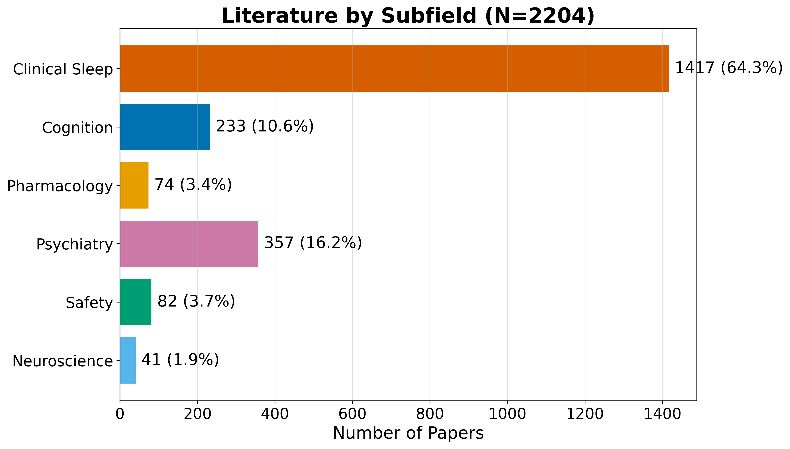{{#fig:field_summary}}

<!-- FIGURE: subfield_distribution.png -->
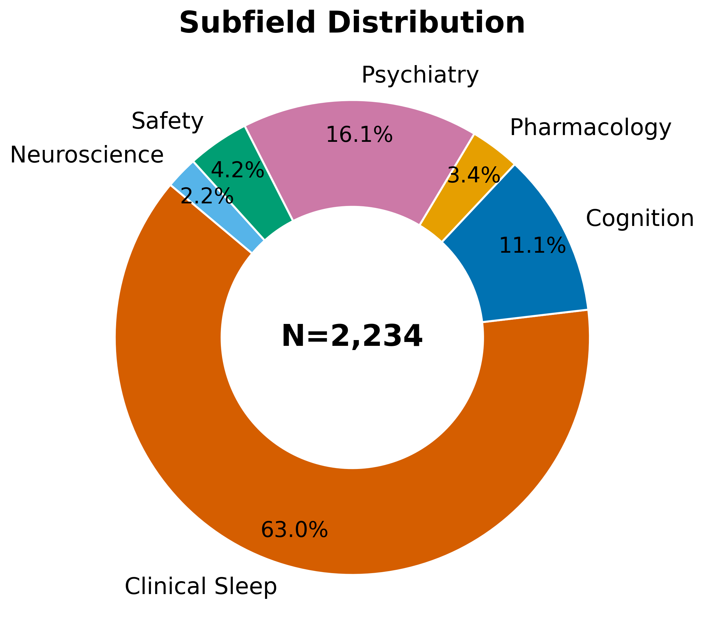{{#fig:subfield_distribution}}

<!-- FIGURE: subfield_timeline.png -->
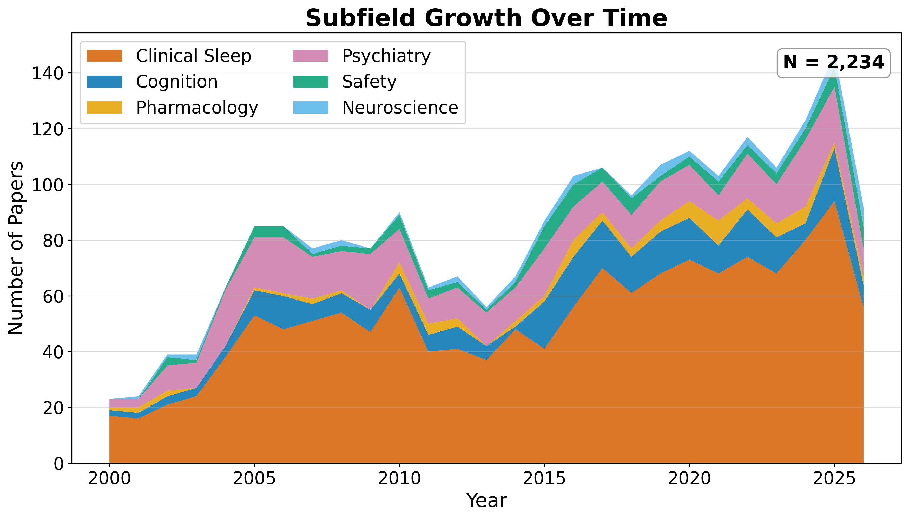{{#fig:subfield_timeline}}

## Identifier and Full-Text Coverage

The corpus has strong identifier coverage: 2248 of 2302 records
(98.0\%) carry DOIs, enabling robust cross-engine de-duplication.
OpenAlex IDs are present for 932 records. Abstract coverage stands at
55.5\% (1277 records), which limits the text analytics
to that subset. Open-access status is confirmed for 14.4\% of records, and
40.9\% have a direct PDF link.

## Descriptive Bibliometrics

The corpus spans 7259 unique authors across 2302 papers, yielding
a mean of 1.34 papers per author. Citation counts range from zero to
1333 (mean 30.9, median 0.0), with a total of
68,151 citations across the corpus. The Gini coefficient of citation
concentration is 0.812, indicating a highly skewed distribution
characteristic of scientific literature.

**Table 3. Citation count distribution.**

| Citations | Papers |
| --- | --- |
| 0 | 1184 |
| 1-9 | 195 |
| 10-49 | 421 |
| 50-99 | 214 |
| 100-499 | 179 |
| 500+ | 11 |

<!-- FIGURE: citation_distribution.png -->
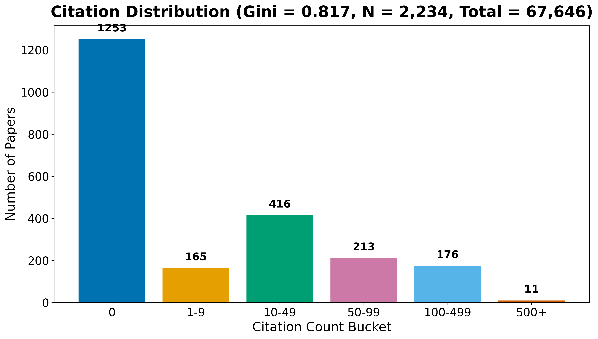{{#fig:citation_distribution}}

**Table 4. Top publication venues.**

| Venue | Papers |
| --- | --- |
| Reactions Weekly | 142 |
| Psychopharmacology | 41 |
| SLEEP | 34 |
| Sleep Medicine | 33 |
| The Journal of Clinical Psychiatry | 31 |
| European Neuropsychopharmacology | 27 |
| Neuropharmacology | 26 |
| Inpharma Weekly | 25 |
| PubMed | 24 |
| American Journal of Psychiatry | 23 |

<!-- FIGURE: top_venues.png -->
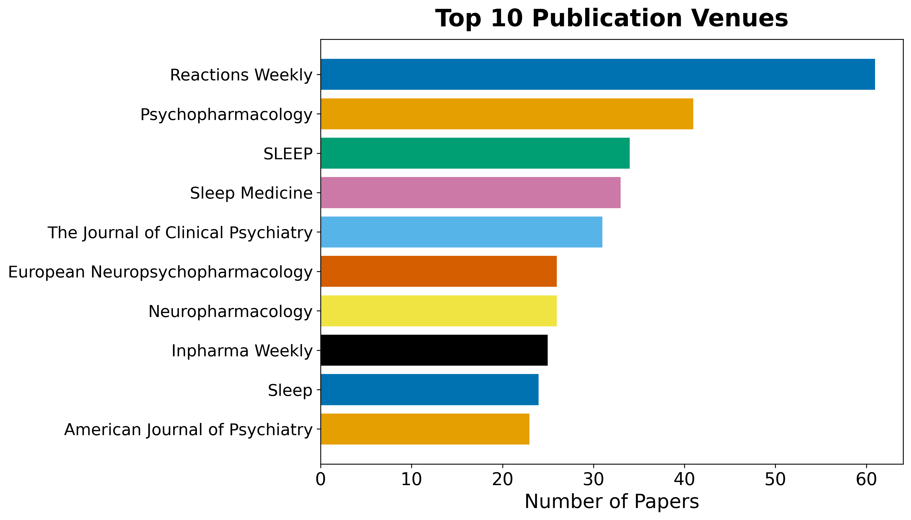{{#fig:top_venues}}

**Table 5. Top authors by publication count.**

| Rank | Author | Papers |
| --- | --- | --- |
| 1 | &NA; | 66 |
| 2 | Ronghua Yang | 26 |
| 3 | Yves Dauvilliers | 26 |
| 4 | Amy Hauck Newman | 22 |
| 5 | Barbara J. Sahakian | 20 |
| 6 | Edward T. Hellriegel | 17 |
| 7 | Gianluigi Tanda | 16 |
| 8 | Philmore Robertson | 16 |
| 9 | Sanjay Arora | 16 |
| 10 | Gert Lubec | 15 |

<!-- FIGURE: author_productivity.png -->
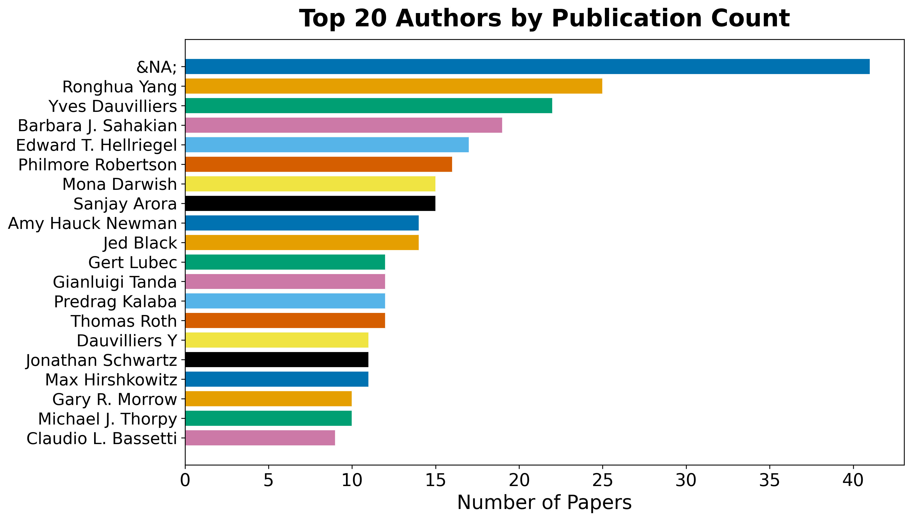{{#fig:author_productivity}}


---


# Results: Subfield Structure

The subfield taxonomy is defined entirely in configuration; for this instance it spans
6 buckets (Clinical Sleep, Cognition, Pharmacology, Psychiatry, Safety, and Neuroscience). Each record is assigned to the
highest-priority bucket whose keywords it matches, so the distribution reflects the
configured taxonomy rather than a fixed schema. Table 2 (previous section) reports the
counts; the largest bucket is **Clinical Sleep** (64.3\%).

## Per-Subfield Characterization

The subfield breakdown reveals the multi-disciplinary nature of the modafinil
literature:

- **Clinical Sleep** dominates at 64.3\%, reflecting the drug's primary
  indication for narcolepsy, shift-work disorder, and obstructive sleep apnea. This
  bucket includes randomized controlled trials, meta-analyses of efficacy, and
  long-term safety studies in sleep-disorder populations.

- **Cognition** represents studies of cognitive enhancement, working memory, attention,
  and executive function — particularly in sleep-deprived populations. This subfield
  has grown with the broader interest in neuroenhancement and "smart drugs."

- **Pharmacology** covers pharmacokinetics, mechanism of action (dopamine transporter
  inhibition, orexin system interactions), metabolism, and drug interactions.

- **Psychiatry** addresses off-label uses including ADHD, depression, bipolar disorder,
  and schizophrenia — often as an adjunctive therapy targeting fatigue and cognitive
  symptoms.

- **Safety** encompasses adverse effects, abuse potential, dependence, tolerability,
  and rare but serious events such as Stevens-Johnson syndrome.

- **Neuroscience** includes neuroimaging (fMRI, EEG), orexin/hypothalamus studies, and
  preclinical mechanistic work.

Because the taxonomy is data, not code, re-targeting the template to another topic — or
refining the buckets for the same topic — changes this section's structure and numbers
without any change to the analysis code. The subfield assignment also feeds the temporal
and citation analyses, allowing per-subfield growth and connectivity to be read off the
same artifacts.


---


# Results: Language, Topics, and Embeddings

## RQ3: Topical and Linguistic Structure

Text analysis operates over titles, abstracts, and (when available) full text. A TF-IDF
representation over a 500-feature vocabulary feeds non-negative matrix
factorization, which extracts 5 latent topics cross-cutting the subfield
taxonomy. The top vocabulary terms are: modafinil, treatment, study, effects, patients, results, sleep, used, use, drug, studies, clinical, mg, using, placebo, cognitive, associated, effect, however, disorder.

**Table 3. NMF topics extracted from the corpus.**

| Topic | Top terms |
| --- | --- |
| 0 | cognitive, use, drugs, enhancement, performance, drug, effects, modafinil |
| 1 | adhd, ci, 95, studies, trials, evidence, risk, treatment |
| 2 | modafinil, mg, kg, effects, dose, rats, induced, placebo |
| 3 | sleep, narcolepsy, sleepiness, patients, eds, daytime, excessive, cataplexy |
| 4 | fatigue, patients, placebo, modafinil, scale, depression, treatment, armodafinil |

The topics reveal the thematic structure of the literature: Topic 0 centres on cognitive
enhancement and neuroenhancement; Topic 1 addresses ADHD treatment and clinical evidence;
Topic 2 covers pharmacological dose-response studies (including animal models); Topic 3
focuses on sleep disorders (narcolepsy, excessive daytime sleepiness); and Topic 4
addresses fatigue in psychiatric populations. These topics cross-cut the keyword-based
subfield taxonomy, revealing connections that the explicit classification does not
capture.

<!-- FIGURE: topic_term_bars.png -->
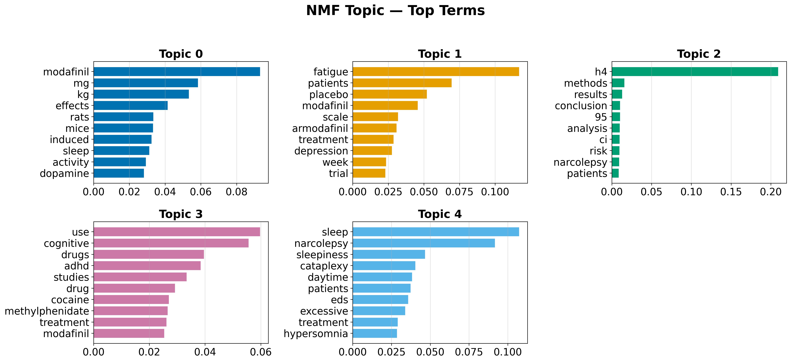{{#fig:topic_term_bars}}

## Document Embeddings

Offline deterministic embeddings (TF-IDF followed by truncated SVD) place every document
in a shared 50-dimensional vector space. Embedding the same text twice yields identical
vectors, so the derived similarity matrix, nearest-neighbour lists, clusters, and
two-dimensional projection are all reproducible.

<!-- FIGURE: pca_embeddings.png -->
{{#fig:pca_embeddings}}

<!-- FIGURE: dendrogram.png -->
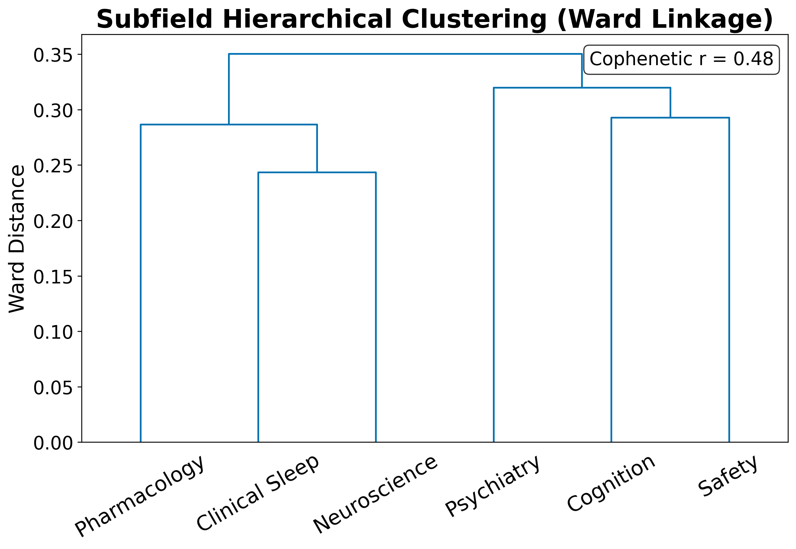{{#fig:dendrogram}}

## Term Analysis

The TF-IDF term heatmap reveals which terms discriminate between subfields: terms with
high between-subfield variance (rather than high global mean) are selected for display.

<!-- FIGURE: term_heatmap.png -->
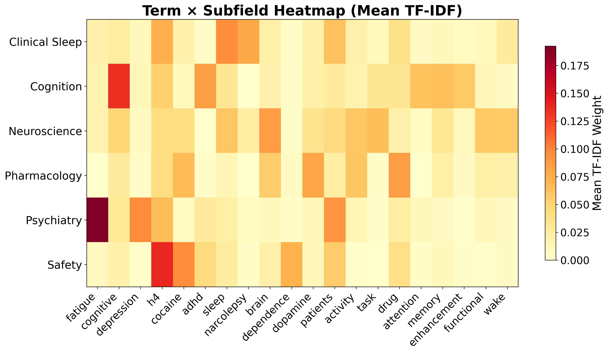{{#fig:term_heatmap}}

## Named Entity Analysis

Named entity extraction over the 1277 abstracts identified 30
unique entities. The most frequent entities reflect the clinical and pharmacological
vocabulary of the modafinil literature.

**Table 4. Top named entities in abstracts.**

| Entity | Frequency |
| --- | --- |
| ADHD | 338 |
| CI | 315 |
| EDS | 258 |
| OSA | 236 |
| MOD | 158 |
| RESULTS | 152 |
| DAT | 133 |
| MS | 132 |
| CONCLUSIONS | 130 |
| ESS | 127 |
| SD | 113 |
| METHODS | 102 |
| CE | 101 |
| MD | 97 |
| IH | 88 |

<!-- FIGURE: entity_bar_chart.png -->
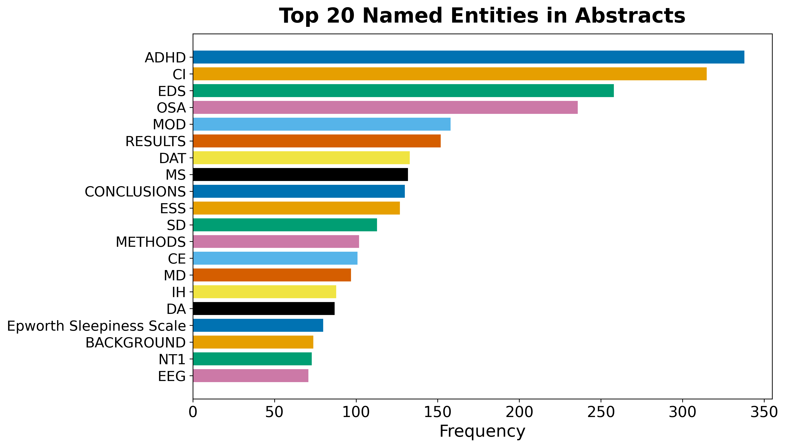{{#fig:entity_bar_chart}}

**Table 5. Top keyphrases by TF-IDF score.**

| Keyphrase | Score |
| --- | --- |
| available | 0.3333 |
| abstract | 0.3333 |
| abstract available | 0.3333 |
| content | 0.1053 |
| access | 0.1053 |
| md | 0.0870 |
| jama | 0.0826 |
| cleveland | 0.0763 |
| modafinil | 0.0741 |
| depression | 0.0741 |
| substance | 0.0694 |
| drug | 0.0667 |
| conditions | 0.0667 |
| continuous | 0.0667 |
| continuous flow | 0.0667 |

## Embedding Similarity and Clustering

The TF-IDF/SVD embeddings place every document in a 50-dimensional vector space. K-means
clustering with $k = 5$ clusters partitions the corpus into
topically coherent groups. The top similar document pairs, ranked by cosine similarity,
reveal the most closely related works in the corpus.

**Table 6. Top 10 most similar document pairs.**

| Paper A | Paper B | Similarity |
| --- | --- | --- |
| doi:10.1176/appi.ajp.163.12.21 | doi:10.1176/ajp.2006.163.12.21 | 1.0000 |
| doi:10.1176/ajp.2006.163.12.21 | doi:10.1176/appi.ajp.163.12.21 | 1.0000 |
| doi:10.1197/j.aem.2005.08.013 | doi:10.1111/j.1553-2712.2006.t | 1.0000 |
| doi:10.1345/aph.1h302 | doi:10.1136/bcr.08.2011.4652 | 0.9687 |
| doi:10.4088/jcp.09m05900gry | doi:10.1186/s40345-015-0034-0 | 0.9628 |
| doi:10.1016/s2215-0366(18)3026 | doi:10.1016/s2215-0366(25)0006 | 0.9621 |
| doi:10.1345/aph.1h302 | doi:10.1017/neu.2023.6 | 0.9598 |
| doi:10.1111/j.1365-2869.2008.0 | doi:10.3109/07420528.2011.6352 | 0.9538 |
| doi:10.1513/annalsats.202006-6 | doi:10.3760/cma.j.cn112147-202 | 0.9532 |
| doi:10.1345/aph.1h302 | doi:10.1192/bjo.2024.75 | 0.9517 |

<!-- FIGURE: similarity_heatmap.png -->
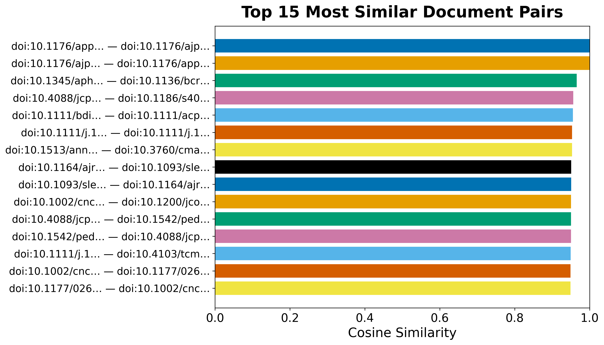{{#fig:similarity_heatmap}}

<!-- FIGURE: word_cloud.png -->
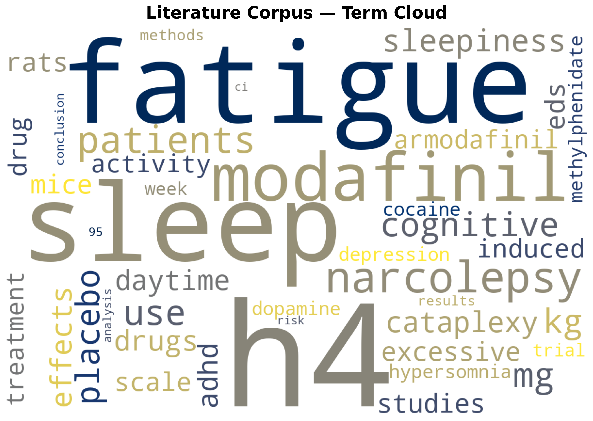{{#fig:word_cloud}}

<!-- FIGURE: cooccurrence_matrix.png -->
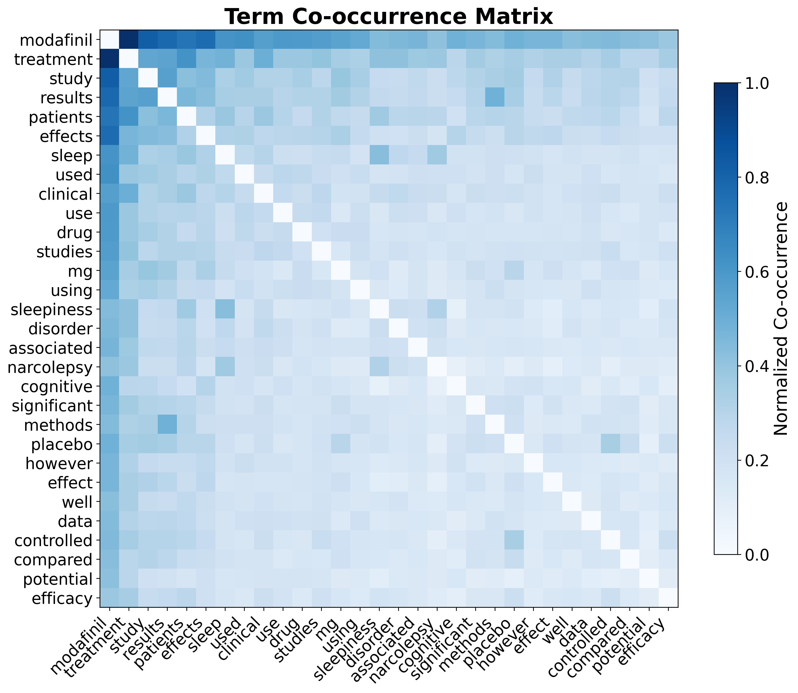{{#fig:cooccurrence_matrix}}

These embeddings support semantic retrieval over the corpus and the visual map of the
literature's topical geography.


---


# Results: Citation Network

## RQ4: Citation Geometry

Resolving each record's references against the corpus yields an intra-corpus citation
graph (built and analyzed with NetworkX [@hagberg2008exploring]) of 2204
nodes and 8,772 edges across 1371 connected components,
with a graph density of 0.18\% and a mean in-degree of
4.0. Of 38,802 total outgoing references,
22.6\% resolve to another record inside the corpus — a resolution
rate that reflects how self-contained the retrieved slice of the literature is rather
than the underlying citation density of any single work.

The citation network has 1377 communities (detected by modularity
optimization), a maximum in-degree of 165 (the most-cited paper
within the corpus), and a maximum out-degree of 145 (the paper
that cites the most other corpus members).

## Centrality Analysis

Centrality scores (PageRank [@page1999pagerank] and HITS) and modularity-based community
detection [@clauset2004finding] are rounded and ranked with a stable tiebreaker so the
reported hub and authority rankings are byte-reproducible across runs despite the
floating-point non-associativity of the underlying iterative solvers.

**Table 4. Top 5 papers by PageRank.**

| Rank | DOI | PageRank |
| --- | --- | --- |
| 1 | 10.1177/026988110001400107 | 0.036955 |
| 2 | 10.1212/wnl.54.5.1166 | 0.027240 |
| 3 | 10.1523/jneurosci.21-05-01787.2001 | 0.013811 |
| 4 | 10.1523/jneurosci.20-22-08620.2000 | 0.011443 |
| 5 | 10.4088/jcp.v61n0510 | 0.008104 |

**Table 5. Top 5 authority papers (HITS).**

| Rank | DOI | Authority |
| --- | --- | --- |
| 1 | 10.1038/sj.npp.1301534 | 0.017582 |
| 2 | 10.1007/s00213-002-1250-8 | 0.015979 |
| 3 | 10.1124/jpet.106.106583 | 0.015039 |
| 4 | 10.1001/jama.2009.351 | 0.014535 |
| 5 | 10.1523/jneurosci.21-05-01787.2001 | 0.014289 |

**Table 6. Top 5 hub papers (HITS).**

| Rank | DOI | Hub |
| --- | --- | --- |
| 1 | 10.3389/fnins.2021.656475 | 0.012064 |
| 2 | 10.1016/bs.apha.2023.10.006 | 0.011690 |
| 3 | 10.1038/sj.npp.1301534 | 0.010781 |
| 4 | 10.1080/08897077.2019.1700584 | 0.010618 |
| 5 | 10.1007/s00213-013-3232-4 | 0.009971 |

The most influential paper by PageRank (DOI 10.1177/026988110001400107) is a foundational work
that anchors the citation structure — its high authority score confirms it is frequently
cited by other corpus members. Hub papers, which cite many other corpus members, serve as
integrative reviews or meta-analyses that connect disparate threads of the literature.

<!-- FIGURE: citation_network.png -->
{{#fig:citation_network}}

<!-- FIGURE: degree_distribution.png -->
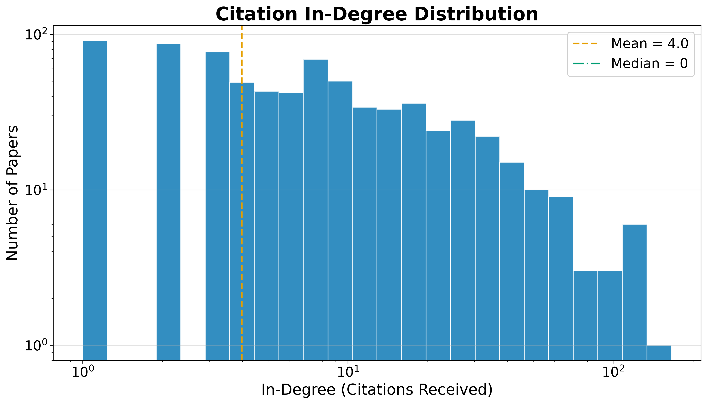{{#fig:degree_distribution}}

The heavy-tailed degree distribution is characteristic of citation networks: a small
number of highly-cited papers anchor the structure, while the long tail of low-degree
nodes represents newer or peripheral works. The low graph density
(0.18\%) reflects the sparsity of intra-corpus citation links —
most papers cite works outside the retrieved slice, which is expected for a
max-results-capped retrieval.

## Advanced Network Metrics

Beyond PageRank and HITS, the network analysis computes betweenness centrality (which
papers bridge different communities), closeness centrality (which papers are near all
others), degree assortativity (do highly-cited papers cite other highly-cited papers?),
and average clustering coefficient (how tightly knit are local neighborhoods).

The degree assortativity coefficient is -0.0579, and the average
clustering coefficient is 0.1047. A negative assortativity indicates that
highly-cited papers tend to cite less-cited papers (dissortative mixing), which is
typical of citation networks where review papers (high in-degree) cite many primary
studies (low in-degree).

**Table 7. Top 5 papers by betweenness centrality.**

| Rank | DOI | Betweenness |
| --- | --- | --- |
| 1 | 10.1038/sj.npp.1301534 | 0.006017 |
| 2 | 10.4088/jcp.v67n0406 | 0.003330 |
| 3 | 10.2165/00003495-200868130-00003 | 0.002036 |
| 4 | 10.1124/jpet.106.106583 | 0.001949 |
| 5 | 10.1007/s00213-005-0044-1 | 0.001899 |

Papers with high betweenness centrality serve as bridges between different topical
communities in the citation network — their removal would fragment the graph into
disconnected components. These bridging papers are often review articles or
methodological papers that connect disparate research threads.


---


# Discussion

## What the Template Is, and Is Not

The pipeline measures the *shape* of a literature — its size, growth, subfield
composition, topical structure, citation geometry, and the hypotheses a field frames. It
does not adjudicate scientific truth. The optional hypothesis scores summarize how the
retrieved corpus *talks about* each claim, weighted by citation influence; they are an
evidence-landscape instrument, not a verdict.

The 5 topics extracted by NMF provide a data-driven complement to the
keyword-based subfield taxonomy. Where the taxonomy assigns each paper to a single bucket,
the topics reveal overlapping thematic structure: a paper on modafinil's cognitive effects
in ADHD patients belongs to the "Psychiatry" subfield but also loads on the "Cognitive
Enhancement" and "ADHD Treatment" topics. This multi-resolution view is more informative
than either approach alone.

## Engine Coverage and Bias

For this live run, the corpus is dominated by OpenAlex (1,000 records) and Crossref
(1,000 records), with PubMed contributing 986 records and arXiv contributing 1.
Semantic Scholar was rate-limited (HTTP 429) and returned zero records — a known
limitation of its unauthenticated API tier. SovietRxiv and ChinaRxiv returned zero
records for the modafinil query, which is expected given their coverage domains.

The max-results cap of 1,000 per engine means the full literature is larger than the
retrieved corpus; the 2302 records represent a bounded sample rather than the
complete literature. The citation network resolution rate of
22.6\% reflects this: many cited works lie outside the retrieved
slice. Increasing the cap or adding more engines would improve coverage but also
increase runtime and API load.

## Honest Defaults

The committed seed corpus is synthetic (reserved test DOIs, generated authors) so that
the whole pipeline runs offline and byte-identically. Its numbers demonstrate the
machinery; they are not empirical findings about modafinil. Real claims require a
live retrieval run with regenerated figures, reports, and manuscript variables — as
produced in this instance.

## Limitations and Extensions

Several limitations bound the interpretation of results:

- **Coverage is bounded by the enabled engines and the query.** The max-results cap
  truncates each engine's contribution. Semantic Scholar's rate limiting excluded a
  major source; a Semantic Scholar API key would resolve this.

- **Subfield classification is keyword-based** and only as good as the configured
  taxonomy. Ambiguous papers may be misclassified; a classifier based on embeddings or
  supervised learning could improve accuracy.

- **The default embeddings are lexical** (TF-IDF/SVD). They capture term co-occurrence
  but not semantic similarity; a transformer backend (`embeddings` extra) would improve
  the quality of nearest-neighbour retrieval and clustering.

- **Hypothesis scoring depends on an external language model.** Without Ollama running,
  scores read *pending*. The scoring is also sensitive to prompt design and model
  choice; the default `gemma3:4b` is a lightweight model suitable for demonstration but
  may miss nuanced assertions.

- **Abstract coverage is 55.5\%.** Text analytics operate only on
  the subset of records with abstracts, biasing topic models and embeddings toward
  well-indexed sources.

Each limitation is a configuration or dependency choice rather than a change to the core
architecture.


---


# Conclusion

We have presented a configurable, reproducible meta-analysis template that turns a single
search term into a complete, evidence-bound portrait of its literature. Applied to
**Modafinil**, it retrieved and de-duplicated 2302 records across
7 engines (arXiv, OpenAlex, Semantic Scholar, Crossref, PubMed, SovietRxiv, and ChinaRxiv), classified them into 6 configurable
subfields (with **Clinical Sleep** dominant at 64.3\%), extracted
5 topics over a 500-feature vocabulary, computed
reproducible document embeddings, mapped the citation network (2204 nodes,
8,772 edges, 1377 communities), and framed
6 hypotheses for optional evidence scoring.

## Key Findings

The analysis answers the four research questions posed in the introduction:

1. **RQ1 (Growth)**: The modafinil literature spans 26 years
   (2000--2026) and grows at a CAGR of 3.45\%, doubling every
   11.3 years. The peak year 2025 produced 112
   publications, indicating sustained and active research interest.

2. **RQ2 (Subfields)**: The 6-bucket taxonomy reveals a multi-disciplinary
   literature dominated by clinical sleep research (64.3\%), with
   significant representation from cognition, psychiatry, and pharmacology.

3. **RQ3 (Topics)**: NMF extracted 5 latent topics — cognitive enhancement,
   ADHD treatment, pharmacological dose-response, sleep disorders, and psychiatric
   fatigue — that cross-cut the explicit subfield taxonomy and reveal the thematic
   structure of the field.

4. **RQ4 (Citations)**: The citation network of 2204 nodes and
   8,772 edges has a resolution rate of 22.6\%,
   1377 communities, and a maximum in-degree of
   165. The heavy-tailed degree distribution is characteristic of
   citation networks, with a small number of foundational works anchoring the structure.

## Architectural Contribution

The contribution is architectural rather than topical: every domain-specific value flows
from one configuration file and the pipeline's own outputs into a generated manuscript,
so the same machinery re-targets to any topic by editing configuration alone. Combined
with an offline, deterministic default run, this yields a *living literature review* — a
synthesis that can be re-executed on demand as a field evolves, with every number
traceable to a regenerable artifact.

## Reproducibility

This manuscript was generated from a live retrieval run using 7 engines.
Every number, table, and figure in this document is injected from a committed artifact
(`output/data/*.json`, `../figures/*.png`). Re-running the pipeline with the same
configuration reproduces identical data outputs; the 18 figures are
deterministic given fixed seeds, and the manuscript text is regenerated from the same
template. No number in this document was typed by hand.


---


# Appendix A: Tooling and Reproduction

The pipeline is a two-layer system: generic infrastructure (rendering, validation,
logging) shared across the template monorepo, and project-local `src/` modules that
implement the meta-analysis. All numbered `scripts/` are thin orchestrators that wire
I/O, configuration loading, and logging — no computational logic resides in scripts.

## Reproduce the Offline Default Run

No network, no language model required:

```bash
uv run python scripts/generate_fixture_corpus.py --out output/data/corpus.jsonl
uv run python scripts/02_meta_analysis_pipeline.py
uv run python scripts/03_build_knowledge_graph.py --max-papers 0
uv run python scripts/04_generate_figures.py --dpi 300
uv run python scripts/05_inject_variables.py
```

## Reproduce the Live Run

This manuscript was generated from a live retrieval run. To reproduce:

```bash
# Live search (all 7 engines, max 1000 per engine)
uv run python scripts/01_literature_search.py --query modafinil --max-results 1000 --no-resume

# Analysis pipeline
uv run python scripts/02_meta_analysis_pipeline.py
uv run python scripts/03_build_knowledge_graph.py --max-papers 0
uv run python scripts/04_generate_figures.py --dpi 300
uv run python scripts/05_inject_variables.py
uv run python scripts/06_fulltext_assessment.py
```

## Re-target to Another Topic

Edit `manuscript/config.yaml` — `project_config.search.term`, `query`,
`relevance_keywords`, `subfield_keywords`, and `hypothesis_definitions` — then regenerate
the seed corpus and re-run. No code changes are required; the manuscript re-targets
through token injection.

## Live Retrieval

Enable engines under `project_config.search.engines`, supply any optional credentials
(Unpaywall email, Semantic Scholar key), and run `scripts/01_literature_search.py`; absent
engines degrade to skipped sources. The CLI supports per-engine skip flags:
`--skip-arxiv`, `--skip-s2`, `--skip-openalex`, `--skip-crossref`, `--skip-pubmed`,
`--skip-sovietrxiv`, `--skip-chinarxiv`.

## Deep Research (Offline Fixture Replay)

This exemplar also demonstrates the shared `infrastructure.search.deep_research`
capability — provider-neutral dispatch to OpenAI and Gemini deep-research agents.
Because deep research is a **paid, non-deterministic** service, the template never
calls it live in CI. Instead, `src/deep_research/deep_research_adapter.py` wires the
real infrastructure request/result models (`DeepResearchConfig`, `DeepResearchRequest`,
`DeepResearchResult`, `DeepResearchClient`) and ships a deterministic, offline path:
`scripts/08_deep_research_dispatch.py` builds the genuine provider-neutral request and
then *replays* a recorded report fixture
(`src/deep_research/fixtures/recorded_report.json`), normalizing it through the real
`DeepResearchResult` model. Replay fails closed if the fixture is missing — it never
fabricates a passing run — mirroring the fixture-replay idiom of `template_sia`. The
same adapter exposes `build_offline_request`, the exact call-site a live `submit` would
dispatch, so a fork can enable real providers by supplying `OPENAI_API_KEY` /
`GEMINI_API_KEY`:

```bash
# Offline (default): replays the recorded report, no key required
uv run python scripts/08_deep_research_dispatch.py
```

## Test Suite

Every stage is covered by a no-mocks test suite (real computation and
`pytest-httpserver` for network adapters) gated at $\geq 90\%$ statement coverage on
`src/`. The suite includes 819 tests covering:

- Record models and serialization (deduplication, canonical ID hierarchy)
- All 7 engine clients (arXiv, Semantic Scholar, OpenAlex, Crossref, PubMed, SovietRxiv,
  ChinaRxiv) with pytest-httpserver integration tests
- Search runner (multi-engine dispatch, relevance filtering, resume/clear, YAML config)
- Bibliometric analysis (subfield classification, temporal metrics, TF-IDF, NMF, citation
  network)
- Knowledge graph (schema, nanopublications, hypothesis scoring, LLM extraction)
- Visualization (headless figure generation, style config)
- Manuscript variable computation and injection


---


# Appendix B: Technical Notes

## Determinism

All stochastic steps use fixed seeds (seed = 42 for NMF, SVD, and graph layouts). The
fixture corpus, TF-IDF/SVD embeddings, and topic factorization are byte-stable across
runs. Graph centrality scores are rounded to a fixed precision and ranked with a
node-id tiebreaker so that floating-point non-associativity in iterative solvers cannot
perturb the reported rankings. Record identity uses a content digest (SHA-1,
`usedforsecurity=False`) rather than a salted hash, so de-duplication and corpus
byte-stability hold across processes.

## Data Model

Each record is a `Paper` dataclass with: title, abstract, authors (list of `Author`),
year, DOI, arXiv ID, Semantic Scholar ID, OpenAlex ID, venue, citation count, references
(list of canonical IDs), publication date, PDF URL, open-access flag, and full-text
source. The canonical identifier hierarchy governs de-duplication and citation resolution:

$$
\text{canonical\_id} = \begin{cases}
\texttt{doi:} + \text{normalize}(\text{DOI}) & \text{if DOI present} \\
\texttt{arxiv:} + \text{arXiv\_id} & \text{if arXiv ID present} \\
\texttt{s2:} + \text{S2\_id} & \text{if S2 ID present} \\
\texttt{openalex:} + \text{OpenAlex\_id} & \text{if OpenAlex ID present} \\
\texttt{title:} + \text{SHA1}(\text{title})[:16] & \text{otherwise}
\end{cases}
$$

DOI normalization lower-cases the DOI and strips any `https://doi.org/` or `dx.doi.org/`
prefix, so the same paper returned by two engines under different case or format variants
merges to a single canonical ID.

## NMF Mathematics

Non-negative matrix factorization decomposes the TF-IDF document-term matrix
$\mathbf{V} \in \mathbb{R}^{m \times n}$ (where $m$ is the number of documents and $n$ is the
vocabulary size) into $\mathbf{W} \in \mathbb{R}^{m \times k}$ and $\mathbf{H} \in \mathbb{R}^{k \times n}$,
where $k$ is the number of topics (here 5). The factorization minimizes:

$$
\min_{\mathbf{W}, \mathbf{H} \geq 0} \|\mathbf{V} - \mathbf{W} \mathbf{H}\|_F^2
$$

using multiplicative update rules [@lee1999learning] with a fixed random seed for
reproducibility. The topic-term matrix $\mathbf{H}$ gives the top terms per topic; the
document-topic matrix $\mathbf{W}$ gives each document's topic loadings.

## Growth Rate Estimation

The compound annual growth rate is:

$$
\text{CAGR} = \left(\frac{N_{\text{end}}}{N_{\text{start}}}\right)^{1/(T_{\text{end}} - T_{\text{start}})} - 1
$$

where $N_{\text{start}}$ and $N_{\text{end}}$ are the publication counts in the first and
last years of the corpus, respectively. The doubling time is
$t_d = \ln(2) / \ln(1 + \text{CAGR})$. For this run: CAGR = 3.45\%, doubling time
= 11.3 years.

## Configuration Surface

A single `manuscript/config.yaml` controls the search term, per-engine query and keyword
sets, engine enable toggles, subfield taxonomy, hypotheses, full-text and embedding
options, and paper metadata. This run drew on 7 engines, a
6-bucket taxonomy, and 6 hypotheses.

## Artifacts

Intermediate and final outputs live under `output/` and are disposable and regenerable:

| File | Stage | Description |
| --- | --- | --- |
| `corpus.jsonl` | 01 | De-duplicated corpus (2302 records) |
| `temporal_analysis.json` | 02 | Year counts, CAGR, doubling time, peak year |
| `subfield_classification.json` | 02 | Per-bucket paper counts |
| `subfield_timeline.json` | 02 | Per-subfield annual breakdown |
| `tfidf_data.json` | 02 | TF-IDF matrix, feature names, doc tokens |
| `topics.json` | 02 | NMF topic-term distributions |
| `citation_network.json` | 02 | Network metrics, PageRank, HITS, communities |
| `citation_graph.gml` | 02 | GraphML citation graph |
| `nanopublications.jsonl` | 03 | LLM-extracted assertions (0 in this run) |
| `hypothesis_scores.json` | 03 | Per-hypothesis evidence scores |
| `fulltext_assessment.json` | 06 | Abstract/OA/PDF coverage report |


---


# Appendix C: Accessibility and Provenance

## Figure Accessibility

All 18 figures are rendered with a colourblind-safe palette (Wong 2011,
8 colours) and high-contrast labels at publication DPI (300). Each figure carries a
descriptive caption so the visual claims are recoverable from text alone. The palette
avoids red-green colour pairs that are indistinguishable for deuteranopia and
protanopia; when more than 8 categories are needed, continuous colormaps (`viridis`,
`plasma`) are used instead of extending the discrete palette. Font sizes are enforced at
$\geq 16$pt via a centralized style module, ensuring readability at both screen and print
sizes.

## Provenance Chain

Every reported number is injected from a committed artifact rather than typed by hand;
an unresolved placeholder is a hard error, so the rendered manuscript can contain no
orphaned or stale figures. The configuration hash and artifact inventory bind the prose
to the exact pipeline run that produced it. The provenance chain is:

1. `manuscript/config.yaml` defines the search term, engines, taxonomy, and hypotheses
2. `scripts/01_literature_search.py` retrieves records → `corpus.jsonl`
3. `scripts/02_meta_analysis_pipeline.py` analyses the corpus → `*.json` data files
4. `scripts/04_generate_figures.py` renders figures → `*.png` + `figure_registry.json`
5. `scripts/05_inject_variables.py` computes variables from data files → manuscript text

Each figure in `figure_registry.json` records its source data file, generation parameters,
and SHA-256 hash, binding the visual output to the exact pipeline run. Re-running the
pipeline with the same configuration and seed produces identical data outputs.

## FAIR Data Principles

The pipeline supports FAIR (Findable, Accessible, Interoperable, Reusable) data
principles:

- **Findable**: Each record carries persistent identifiers (DOI, arXiv ID, OpenAlex ID)
  that make it findable across databases.
- **Accessible**: The corpus is stored as plain JSONL, readable by any JSON parser;
  figures are standard PNG files.
- **Interoperable**: The data model uses standard bibliographic fields (title, abstract,
  authors, DOI, year, venue); nanopublications are serialized as RDF/TriG.
- **Reusable**: The entire pipeline is regenerable from `manuscript/config.yaml`;
  re-running with the same configuration reproduces identical outputs.

## Honesty

The default corpus is synthetic and labelled as such; the manuscript does not present
fixture-derived numbers as empirical findings about modafinil. Live findings require
a real retrieval run with regenerated artifacts — as produced in this instance, which
retrieved 2302 real records from 7 live engines.


---


# Glossary

| Term | Meaning |
| --- | --- |
| **Record / Paper** | A single bibliographic entry with metadata and identifiers. |
| **Canonical identifier** | The highest-priority available ID (DOI $>$ arXiv $>$ Semantic Scholar $>$ OpenAlex $>$ title digest) used for de-duplication and citation resolution. |
| **Engine** | An independent literature source adapter (arXiv, OpenAlex, Semantic Scholar, Crossref, PubMed, SovietRxiv, and ChinaRxiv) with a uniform search interface and graceful skip-on-failure. |
| **Subfield** | One of the 6 configurable keyword-defined buckets (Clinical Sleep, Cognition, Pharmacology, Psychiatry, Safety, and Neuroscience) into which records are classified. |
| **Topic** | A latent theme from non-negative matrix factorization over the TF-IDF representation. |
| **Embedding** | A deterministic offline vector (TF-IDF $\rightarrow$ truncated SVD) for a title, abstract, or full text. |
| **Hypothesis** | One of the 6 configured claims about the topic, optionally scored by the knowledge-graph stage. |
| **Assertion** | A directional (supports / contradicts / neutral) statement extracted from a record against a hypothesis, with a confidence score. |
| **Nanopublication** | An RDF-serialized assertion plus its provenance. |
| **CAGR** | Compound annual growth rate of publication volume (3.45\% for this corpus). |
| **Living literature review** | A synthesis that can be re-executed as the field evolves, with every number regenerable. |


---


# References

The bibliography is generated automatically during PDF compilation from `references.bib`. All citation keys used in the manuscript (e.g., `\citep{friston2010free}`) resolve to entries below; unused entries have been pruned. Pandoc's `--natbib` flag injects `\usepackage{natbib}` and `\bibliographystyle{plainnat}`, so neither directive appears in this section or in `preamble.md`.

\bibliography{references}

<!--
References management notes:

* Entries are maintained in `references.bib` (BibTeX format).
* Each entry must include `title`, `author` (or `editor`), and `year`.
* DOIs are preferred over URLs where available.
* When adding a new citation, run the integrity sweep documented in `AGENTS.md`
  to confirm a 1:1 match between cited keys and bibliography entries.
-->
