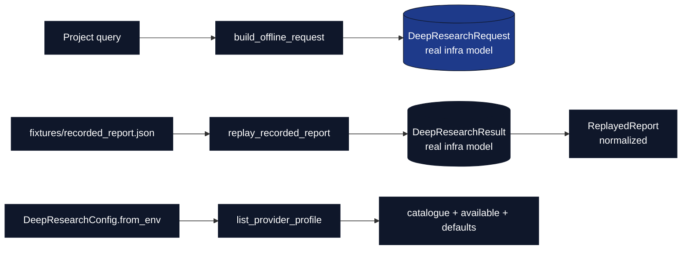

# Deep Research Adapter

Offline adapter over the shared `infrastructure.search.deep_research` package —
the provider-neutral dispatch surface for OpenAI / Gemini deep-research agents.
Deep research is a **paid, non-deterministic** capability, so this exemplar
exercises it through deterministic, recorded-report **replay**: no network, no
API key. The orchestrator is `scripts/08_deep_research_dispatch.py`.



## Public API (`deep_research_adapter.py`)

- `list_provider_profile() -> dict` — provider `catalogue` (openai, gemini),
  `available` providers (key-gated; empty in CI), and the default
  `openai_model` / `gemini_agent`. No network call.
- `build_offline_request(query, *, provider="auto") -> DeepResearchRequest` —
  the genuine provider-neutral request a live `submit()` would dispatch.
- `replay_recorded_report(fixture_path=None) -> ReplayedReport` — loads a
  recorded report JSON (default: the bundled fixture), rebuilds the real
  `DeepResearchResult`, and returns a normalized `ReplayedReport` (provider,
  status, query, output text, title/url citations). Raises `FileNotFoundError`
  if the fixture is absent — fails closed, never fabricates.
- `default_fixture_path() -> Path` — path to `fixtures/recorded_report.json`.

## Usage

```bash
# Offline (default): replays the recorded report, prints the artifact path
uv run python scripts/08_deep_research_dispatch.py

# Replay a caller-supplied recorded report
uv run python scripts/08_deep_research_dispatch.py --fixture path/to/report.json
```

For a live run (outside CI), set `OPENAI_API_KEY` / `GEMINI_API_KEY` and extend
the adapter to call `DeepResearchClient.submit_and_wait_many(...)`; this
exemplar deliberately keeps the default path offline and deterministic.

See [AGENTS.md](AGENTS.md) for agent-specific invariants.
